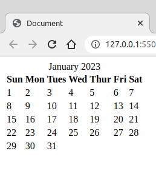

# monthly-calendar-js
This is a JavaScript function that returns a tagged html monthly calendar element.


```
//Input:
//  full year: number like 2023 for example
//  month0Indexed: a number 0 is January, 11 is December
//  tableIDPrefix: a string to help tag the elements of the returned html string which is built by the function
//Output:
//  a string containing html formatted table with indexed elements
//  the table's id will be the tableIDPrefix year and month example mytable-2023-01
//  the tables caption would be mytable-2023-01-caption
//  the tables elements will be mytable-2023-12-31 for example
//  
//  example:
//  let thisMonthsCalendar = makeMonthlyCalendar(2023,3,"mytable");//April 2023
//
//  This will return an unformatted version of the html element below
//  Notice that the format of the dates in the html table are similar to the html input format
//  ie Jan 31, 2003 would be 2003-01-31 
//
/*
<table id="mytable-2023-04">
    <caption id="mytable-2023-04-caption">April 2023</caption>
    <tr>
        <th>Sun</th>
        <th>Mon</th>
        <th>Tues</th>
        <th>Wed</th>
        <th>Thur</th>
        <th>Fri</th>
        <th>Sat</th>
    </tr>
    <tr>
        <td></td>
        <td></td>
        <td></td>
        <td></td>
        <td></td>
        <td></td>
        <td id="mytable-2023-04-01">1</td>
    </tr>
    <tr>
        <td id="mytable-2023-04-02">2</td>
        <td id="mytable-2023-04-03">3</td>
        <td id="mytable-2023-04-04">4</td>
        <td id="mytable-2023-04-05">5</td>
        <td id="mytable-2023-04-06">6</td>
        <td id="mytable-2023-04-07">7</td>
        <td id="mytable-2023-04-08">8</td>
    </tr>
    <tr>
        <td id="mytable-2023-04-09">9</td>
        <td id="mytable-2023-04-10">10</td>
        <td id="mytable-2023-04-11">11</td>
        <td id="mytable-2023-04-12">12</td>
        <td id="mytable-2023-04-13">13</td>
        <td id="mytable-2023-04-14">14</td>
        <td id="mytable-2023-04-15">15</td>
    </tr>
    <tr>
        <td id="mytable-2023-04-16">16</td>
        <td id="mytable-2023-04-17">17</td>
        <td id="mytable-2023-04-18">18</td>
        <td id="mytable-2023-04-19">19</td>
        <td id="mytable-2023-04-20">20</td>
        <td id="mytable-2023-04-21">21</td>
        <td id="mytable-2023-04-22">22</td>
    </tr>
    <tr>
        <td id="mytable-2023-04-23">23</td>
        <td id="mytable-2023-04-24">24</td>
        <td id="mytable-2023-04-25">25</td>
        <td id="mytable-2023-04-26">26</td>
        <td id="mytable-2023-04-27">27</td>
        <td id="mytable-2023-04-28">28</td>
        <td id="mytable-2023-04-29">29</td>
    </tr>
    <tr>
        <td id="mytable-2023-04-30">30</td>
        <td></td>
        <td></td>
        <td></td>
        <td></td>
        <td></td>
        <td></td>
    </tr>
</table>
```
